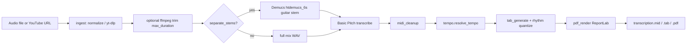

# Project Briefing: audio-to-tab-pdf

## 1. One-paragraph summary

**audio-to-tab-pdf** (v0.1.0, MIT) converts local audio (MP3/WAV/FLAC/M4A) or YouTube URLs into draft guitar tablature PDFs using free/open-source tools. Pipeline: ingest → optional Demucs guitar stem → Basic Pitch transcription → MIDI cleanup → fret assignment → structured PDF. Best on solo acoustic guitar; full mixes need Demucs. Output is a starting sketch — no bends/slides/hammer-ons, standard tuning only, ghost notes possible. Primary UX is Streamlit (`make ui`); optional FastAPI job API (`make backend`); CLI entry points via setuptools scripts.

## 2. Full project tree

```
audio_to_tab_pdf/
├── README.md                          — user docs, pipeline overview, known limits
├── pyproject.toml                     — package metadata, deps, extras, console scripts
├── requirements.txt                   — flat pip pin list (core + eval/dev bits)
├── requirements-demucs.txt            — demucs + torch + torchaudio + torchcodec
├── Makefile                           — install, ui, backend, test, eval targets
├── Dockerfile                         — Python 3.11 API image with ffmpeg + demucs
├── docker-compose.yml                 — backend service mapping port 8000 + data volume
├── .python-version                    — pins 3.11 for local tooling
├── .gitignore                         — ignores venvs, data/, output/, most *.wav
├── .streamlit/
│   ├── config.toml                    — Streamlit config
│   └── credentials.toml               — Streamlit credentials
├── .vscode/settings.json              — editor settings
├── src/audio_to_tab/                  — core library (setuptools package root)
│   ├── __init__.py                    — version 0.1.0
│   ├── pipeline.py                    — PipelineConfig + run_pipeline orchestration
│   ├── ingest.py                      — ffmpeg normalize + yt-dlp YouTube download
│   ├── separate.py                    — Demucs CLI wrapper (sys.executable -m demucs)
│   ├── transcribe.py                  — Basic Pitch → MIDI (+ cleanup hook)
│   ├── midi_cleanup.py                — velocity/duration/density filters
│   ├── tempo.py                       — audio/MIDI tempo estimate + override
│   ├── tuning.py                      — standard-tuning pitch → fret positions
│   ├── tab_generate.py                — MIDI → TabDocument (fret assignment) + ASCII
│   ├── rhythm.py                      — grid quantization of TabDocument
│   ├── pdf_render.py                  — ReportLab structured tab PDF
│   └── cli/
│       ├── pipeline.py                — audio-pipeline CLI
│       ├── transcribe.py              — audio-transcribe CLI
│       ├── mid2tab.py                 — audio-mid2tab CLI
│       └── tab2pdf.py                 — audio-tab2pdf CLI
├── ui/app.py                          — Streamlit web UI (calls run_pipeline)
├── backend/
│   ├── main.py                        — FastAPI routes + WebSocket progress
│   ├── config.py                      — ATT_* Settings (host/port/data_dir/cors)
│   ├── contracts.py                   — Pydantic job/upload DTOs
│   └── jobs/
│       ├── manager.py                 — in-memory JobManager + disk artifacts
│       └── runner.py                  — background job → run_pipeline
├── tests/
│   ├── conftest.py                    — pytest fixtures
│   ├── test_tab.py                    — tab/demucs-availability tests
│   └── test_api.py                    — FastAPI tests (httpx)
├── eval/
│   ├── generate_fixtures.py           — synthetic MIDI/WAV fixtures
│   ├── score_transcription.py         — mir_eval F1 scoring
│   └── fixtures/                      — solo_melody / arpeggio / chords mid+wav + manifest
├── data/                              — runtime uploads / ui_runs / jobs [gitignored]
└── output/                            — example CLI outputs [gitignored]
```

Not expanded: `.venv311/`, `__pycache__/`, `*.egg-info/`, `.git/`, large binaries under `data/` and `output/`.

Note: `.gitignore` mentions `frontend/` Flutter paths, but **no `frontend/` directory is present** in the tree right now (`[uncertain]` if planned vs leftover).

## 3. Tech stack

| Layer | Choice |
|--------|--------|
| Language | Python **≥3.10,<3.13** (README recommends **3.11**; `.python-version` = `3.11`; Basic Pitch does not support 3.13) |
| Core ML/audio | `basic-pitch[onnx]`, `onnxruntime`, `librosa`, `soundfile`, `pretty_midi`, `numpy` |
| Stem sep (optional extra) | `demucs`, `torch`, `torchaudio`, **`torchcodec>=0.14,<0.15`** |
| PDF | `reportlab` |
| UI | `streamlit` |
| API | `fastapi`, `uvicorn`, `python-multipart`, `pydantic`, `pydantic-settings` |
| YouTube | `yt-dlp` |
| Eval/dev | `mir_eval`, `scipy`, `pytest`, `httpx`, `ruff` |
| System tools | **ffmpeg** (required); shared FFmpeg libs needed for torchcodec; fluidsynth optional for eval WAVs |

**Install paths**

- `make install` → create `.venv311`, `pip install -e ".[dev,eval,demucs]"`
- `make install-demucs` → `pip install -r requirements-demucs.txt`
- Docker API image installs `".[dev,eval]"` then `requirements-demucs.txt`
- Makefile prefers `.venv311/bin/python` when present; sets `PYTHONPATH=src:.`

## 4. Architecture & data flow



**Entry points**

| Surface | Launch | Calls |
|---------|--------|--------|
| Streamlit UI | `make ui` → `streamlit run ui/app.py :8501` | `run_pipeline` in-process; adds `src/` to `sys.path` |
| FastAPI | `make backend` → `uvicorn backend.main:app :8000` | `JobManager` + `run_job_async` → `run_pipeline` |
| CLI full | `audio-pipeline` | `audio_to_tab.cli.pipeline:main` |
| CLI steps | `audio-transcribe`, `audio-mid2tab`, `audio-tab2pdf` | respective cli modules |
| Docker | `docker-compose up` backend | same FastAPI app; `ATT_DATA_DIR=/app/data` |

**Config**

- Pipeline behavior: `PipelineConfig` dataclass in `src/audio_to_tab/pipeline.py` (separation, Demucs quality/device, thresholds, tempo override, title, max duration, mix-aware filtering).
- Backend host/port/data/cors: `backend/config.py` `Settings` with env prefix **`ATT_`** (e.g. `ATT_DATA_DIR`).
- Cleanup presets: `mix_aware_cleanup_config()` / `solo_guitar_cleanup_config()` in `midi_cleanup.py`; mix-aware also raises Basic Pitch thresholds inside `run_pipeline`.

**Default Demucs model:** `htdemucs_6s` (expects a `guitar.wav` stem). Quality presets: fast / balanced / high / extreme → Demucs `--shifts` / `--overlap`.

## 5. Module map

| Path | Responsibility | Key symbols | Called by |
|------|----------------|-------------|-----------|
| `pipeline.py` | Orchestrate end-to-end | `PipelineConfig`, `run_pipeline` | UI, backend runner, `cli/pipeline` |
| `ingest.py` | Normalize WAV via ffmpeg; YouTube → audio | `normalize_audio`, `download_youtube_audio` | `pipeline` |
| `separate.py` | Optional guitar stem | `is_demucs_available`, `separate_guitar_stem` | `pipeline`, UI availability check |
| `transcribe.py` | Basic Pitch → MIDI | `transcribe_audio` | `pipeline`, `cli/transcribe` |
| `midi_cleanup.py` | Filter noisy notes | `CleanupConfig`, `cleanup_midi`, mix/solo presets | `transcribe` / pipeline thresholds |
| `tempo.py` | BPM estimate | `resolve_tempo`, `TempoEstimate` | `pipeline` |
| `tuning.py` | Pitch → fret candidates | `positions_for_pitch`, `STANDARD_TUNING_MIDI` | `tab_generate` |
| `tab_generate.py` | Fretting + ASCII tab | `TabDocument`, `midi_to_tab`, `tab_to_ascii` | `pipeline`, mid2tab CLI |
| `rhythm.py` | Quantize tab times | `quantize_tab_document` | `pipeline` |
| `pdf_render.py` | Draw PDF | `render_structured_tab_pdf` | `pipeline`, tab2pdf CLI |
| `ui/app.py` | Web form + progress | `main`, toggles separate | User via Streamlit |
| `backend/main.py` | REST + WS API | upload/jobs/artifacts/ws | External clients |
| `backend/jobs/*` | Persist runs, async execute | `JobManager`, `run_job_async` | FastAPI |
| `eval/*` | Synthetic fixtures + F1 | `generate_fixtures`, `score_transcription` | `make eval` |
| `tests/*` | Unit/API tests | demucs available, tab, API | `make test` |

## 6. Critical invariants / known gotchas

- **Python:** `requires-python = ">=3.10,<3.13"` — do not use 3.13 for Basic Pitch.
- **Demucs is optional for install, effectively required for full mixes.** `--no-separate` / UI toggle for solo guitar. If separation enabled and Demucs fails, pipeline **raises** (does not silently fall back) with install hint.
- **`separate.py` MUST launch Demucs with `sys.executable -m demucs`**, not `shutil.which("python3")`. On macOS, bare `python3` often resolves to system Frameworks 3.13 without Demucs → `No module named demucs` even when `.venv311` is correctly installed.
- **torchaudio ≥2.9 saves via TorchCodec.** Project pins `torchcodec>=0.14,<0.15` with demucs extras. Needs **FFmpeg shared libraries** on the host.
- **Default UI/CLI:** separation on when Demucs importable; CLI default quality `balanced`; `PipelineConfig.demucs_quality` default `"balanced"`; `separate_guitar_stem` default quality arg is `"fast"` but pipeline passes config through.
- **ffmpeg required** for normalize/trim/YouTube path; trim silently skipped if ffmpeg missing.
- **YouTube:** legal/ToS responsibility on the user (disclaimer in README/UI/CLI).
- **Standard tuning only** in v1; no articulation detection.
- **Streamlit may keep stale imported modules** if UI was started before a code fix — restart `make ui` after changing library code under `src/`.
- Docker Compose runs **backend only** (no Streamlit service in compose file).

## 7. Commands cheat sheet

```bash
# Install (venv + editable package + demucs extras)
make install

# Or refresh demucs stack only
make install-demucs

# Web UI
make ui
# → http://localhost:8501

# API
make backend
# → http://localhost:8000/docs

# Tests / eval
make fixtures
make test
make eval

# CLI (after pip install -e .; PYTHONPATH=src if needed)
audio-pipeline --audio song.wav --output ./output --no-separate
audio-pipeline --audio full_mix.mp3 --output ./output --quality fast
audio-pipeline --url "https://www.youtube.com/watch?v=..." --output ./output

audio-transcribe song.wav song.mid
audio-mid2tab song.mid song.tab
audio-tab2pdf song.mid song.pdf

# Docker API
docker compose up --build
```

## 8. External-AI handoff blurb

You are helping with **audio-to-tab-pdf**, a Python 3.10–3.12 app that turns audio/YouTube into draft guitar tab PDFs: ingest → optional Demucs (`htdemucs_6s`) → Basic Pitch → MIDI cleanup → fret tab → ReportLab PDF. Core code lives in `src/audio_to_tab/`; UI is `ui/app.py`; API is `backend/`. Orchestration is `PipelineConfig` + `run_pipeline`. Full mixes need Demucs + torchcodec + ffmpeg (shared libs); solo guitar can `--no-separate`. Always run Demucs via `sys.executable`, not system `python3`. Prefer Makefile targets and small, verified edits — do not invent frontend/Flutter or APIs not in the tree. Output is draft quality only.
